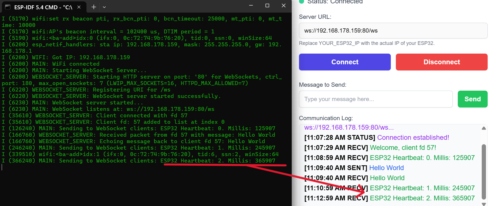

** Readme files **
Most of the information here is coming from version 2.0. For final up-to-date information, read carefully the readme.md in the root directory of the project: https://github.com/georgevio/TriCloudEdge

## Project Architecture

This project is the edge component of a three-tier cloud architecture. It has been refactored for stability and improved configuration management.
The ESP32-S3 edge device performs facial recognition (identification) by comparing a received image against a local database of known faces. This intermediate step allows for rapid identification without requiring cloud communication for known faces. If a face is not recognized locally, the ESP32-S3 uses MQTT and HTTP upload to S3 of AWS to transfer the task to the cloud AWS for more intensive investigation, such as comparing it against a larger database.

## Websocket server implementation 




This here, is the edge cloud part of a three-tier cloud implementation.

In particular, the ESP32-S3 edge device performs facial recognition (identification) by comparing the received image against a local database of known faces. This intermediate step helps for rapid identification without cloud communication, reducing response time for standard, known faces (e.g., the database holds faces of all personnel).

If the face is not recognized in the local database, the ESP32-S3 transfers the task to the cloud tier via MQTT to send the image to AWS IoT for more intensive investigation, such as comparison against an extensive database or further analysis (e.g., false positives/negatives of sensors).

## Core Functionalities

**Wi-Fi Connectivity:** Connects to a specified Wi-Fi network and ensures time is synchronized via NTP, which is critical for TLS connections to cloud services.

**WebSocket Server:** Starts a WebSocket server for real-time communication with clients, including a heartbeat mechanism.

**S3 Uploader:** A robust module that performs a self-test on startup to verify its ability to communicate with AWS. It retrieves a secure, pre-signed URL from an API Gateway and uses it to upload files (e.g., face embeddings) directly to an S3 bucket.

**Facial Recognition:** Utilizes local databases to perform initial face identification before escalating to the cloud

## Configuration

All project configuration is centralized in two files:

1. config.h
non-sensitive settings and feature flags
S3_UPLOADER_ENABLED, MQTT_ENABLED, WEBSOCKET_ENABLED, EXTRA_DEBUG_LOGS

2. secret.h
All secrets, credentials, and private endpoints.
Should NOT be committed to version control. A template is presented in the folder of the project. 

Before building, you must create and populate this file with your own credentials:

WIFI_SSID & WIFI_PASSWORD:
API_GATEWAY_HOST & API_GATEWAY_PATH: AWS API Gateway endpoint that generates pre-signed S3 URLs.
AWS_IOT_ENDPOINT & AWS_IOT_CLIENT_ID: AWS IoT Core endpoint and the desired client ID for the device.

# Project Structure & Dependencies

## Key Source Files

**main.cpp:** The main application entry point that initializes all services.

**wifi.c:** Handles all Wi-Fi connection logic and NTP time synchronization.

**s3_uploader.c:** Implements the logic for getting pre-signed URLs from API Gateway and uploading files to S3.

**mqtt.c:** Manages the connection and communication with the AWS IoT Core MQTT broker.

**face_database.c, face_recognizer.cpp, etc.:** Contain the core logic for the facial recognition features.

### Certificates
The application uses TLS to securely communicate with AWS. The necessary certificates are not stored in the code but are embedded into the binary at compile time.

Place your AmazonRootCA1.pem, new_certificate.pem (your device certificate), and new_private.key inside the /certificates folder.

The main/CMakeLists.txt file  handles the embedding of these files, making them available to the application automatically.

## ESP-S3 Characteristics Discovery

Press BOTH buttons on the device, i.e., BOOT & RST. Run this

`esptool.py --port COM9 flash_id`

The output should be something like this. Note the memory, the chip freq, etc. 
```
esptool.py v4.8.1
Serial port COM9
Connecting...
Detecting chip type... ESP32-S3
Chip is ESP32-S3 (QFN56) (revision v0.2)
Features: WiFi, BLE, Embedded PSRAM 8MB (AP_3v3)
Crystal is 40MHz
MAC: f0:9e:9e:20:9f:30
Uploading stub...
Running stub...
Stub running...
Manufacturer: 85
Device: 2018
Detected flash size: 16MB
Flash type set in eFuse: quad (4 data lines)
Flash voltage set by eFuse to 3.3V
Hard resetting via RTS pin...
```

## Open topic
There is a mixture between the idf_component.yml and the CMakeLists.txt. Ideally, there should be either the one or the other. The yml seems more modern approach (downloads automatically), yet...