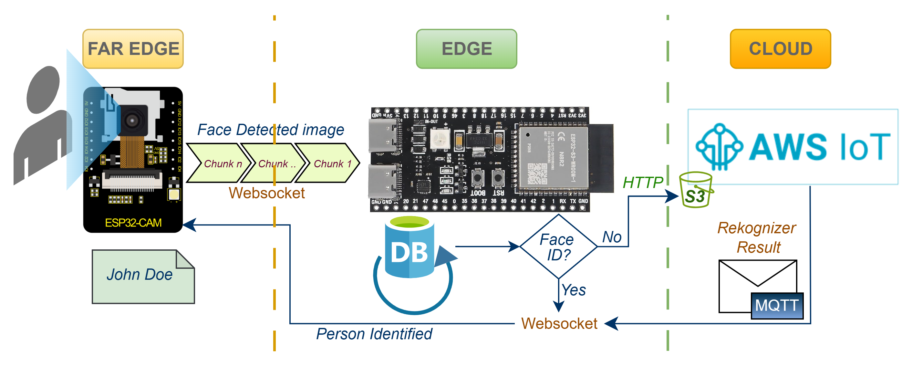

# TriCloudEdge v3.0: 3-layer Cloud Edge Platform




**TriCloudEdge v3.0**, is a three-tier IoT system designed to distribute tasks across a **Far-Edge, Edge, and Cloud Continuum**. An ESP32-CAM at the far-edge detects a face, crops the image, and sends it to a more powerful ESP32-S3 acting as the edge server. The edge device then tries to recognize the face against a local database; if the face is not found, the image is forwarded to the CLoud (AWS) for more intensive analysis with services like Amazon Rekognition. This architecture can have speed and resource efficiency by processing data at the right level, utilizing WebSockets for edge communication and HTTP & MQTT for cloud integration.

## ⚠️ TriCloudEdge v3.0: Major Updates (No compatibility with v2.0)

This version is **not backward-compatible** with v2.0. The architecture, codebase, and setup have been restructured for robustness, scalability, testing, and usability. The previous v2.0 code is in [v2.0.0 tag](https://github.com/georgevio/TriCloudEdge/tree/v2.0.0) for reference only.

**Updates in v3.0**

TriCloudEdge v3.0 has now a **decoupled, service-oriented architecture**.
It includes several new items, i.e., NTP time sync (essential for cloud sync like AWS), MQTT robust connections, fully functional face rekognition in AWS, S3 functional bucket in AWS, messages back to ESP32-S3 (edge) of face identified over MQTT, and message of the same over websocket with the face id results to the ESP32-CAM (far edge). In the far edge a separate message handler mechanism can be further extended. 

Some core principles of v3.0:
* **Scalability:** Each part of the system (data ingestion, face processing, cloud communication) is an independent service that can be scaled or updated separately.
* **Extensibility:** Easily add new types of AI models, or cloud integrations by adding new services.

## Centralized logging

Version 3.0 is using the ESP-IDF logging library for centralized easy-to-use detailed diagnostics. The logging behavior can be customized for either the entire system or for specific module only to handle ad hoc debugging.

***Global Log Level***

The default log level for all modules (both system- and user-level) is set in config.h. Modify the DEFAULT_SYSTEM_LOG_LEVEL variable accordingly. Accepted levels are also mentioned as below.

```
// In config.h
/*
 * Set the default log level if not otherwise set, for
 * system level applications.
 * Available levels:
 * ESP_LOG_NONE, ESP_LOG_ERROR, ESP_LOG_WARN,
 * ESP_LOG_INFO, ESP_LOG_DEBUG, ESP_LOG_VERBOSE
 */
#define DEFAULT_SYSTEM_LOG_LEVEL ESP_LOG_WARN
```

***Module-Specific Log Levels***

For individual control, set the log level for specific modules within the ```configure_system_logging()``` function in main.cpp. You can debug individual component(s) without being flooded with messages from all other modules (CAREFUL: if all enabled it will be a cataclysm of messages!).

```
// In main.cpp
static void configure_system_logging() {
    // Set the level for all modules first
    esp_log_level_set("*", DEFAULT_SYSTEM_LOG_LEVEL);

    // Set differet level for individual modules
    esp_log_level_set("MAIN", ESP_LOG_INFO);
    esp_log_level_set("WIFI", ESP_LOG_INFO);
	
    esp_log_level_set("S3_UPLOADER", ESP_LOG_VERBOSE);
}
```
***Viewing Verbose Logs***

***IMPORTANT:*** To view log messages higher than INFO (e.g., DEBUG, VERBOSE), you ***MUST*** configure the project using the ESP-IDF menuconfig tool:
	Run ```idf.py menuconfig``` in the project's root directory.
	Goto ```Component config -> Log output```.
	Change ```Maximum log verbosity``` from Info to Verbose.
Save  and exit.

## ESP32 Far Edge-Edge-Cloud IoT Application

This document provides a complete overview and setup guide for a three-tier IoT architecture project using ESP32 devices and AWS cloud services. The system is designed for decentralized processing, distributing tasks from the far-edge (ESP32-CAM) to the edge (ESP32-S3) and finally to the Cloud (currently AWS-IOT).

**Project Architecture and Purpose**

The project implements a three-tier IoT system optimized for speed and resource efficiency by assigning tasks to the most appropriate level of the continuum (far edge-edge-cloud).

1.  **Far-Edge (ESP32-CAM):** This tier is responsible for initial **face detection**. Due to limited processing capabilities (remember the cost of an ESP32-CAM), it can only detect the presence of a face in the video feed. Once a face is detected, it crops the image to the face\'s bounding box and transmits only that smaller image to the edge device saving resources.

2.  **Edge (ESP32-S3):** This more powerful device (AI-capable) acts as the edge server. It receives the face image from the far-edge device over a WebSocket connection. It then performs **facial recognition** by comparing the image against a local database of known faces stored in its flash memory. This allows for rapid identification without cloud latency.

3.  **Cloud (AWS IoT):** If the face is not recognized in the local database at the edge, the ESP32-S3 forwards the image to the cloud tier via http and signals a message over MQTT. AWS can then perform more intensive investigations, such as comparison against a much larger database or other advanced analytics and models (e.g., federated AI). Currently, it utilizes the face rekognizer service of AWS.

**System Architecture Diagram**

Abstract Representation of Basic Flow


**Features and Core Functionalities**

-   **WiFi Connectivity:** Connects to a local WiFi network and     synchronizes time via NTP (websocket server - Edge - ESP32-S3), which is crucial for secure TLS  & AWS connections.
-   **Modular Design:** Functionalities like MQTT, WebSocket, and S3 uploading can be enabled or disabled via config.h (ESP32-S3).
-   **WebSocket Server:** A server on the ESP32-S3 to achieve   persistent, low-latency communication with far-edge clients (ESP32-CAM). It   accepts connections over a heartbeat mechanism to maintain the connection (heartbeat mechanism didnot prove its necessity!).
-   **MQTT Client:** Enables communication with cloud services (e.g., AWS upload informative),  pre-configured for AWS IoT, for tasks that exceed the edge\'s capabilities.
-   **AWS S3 Integration:** Includes a module to upload images to an AWS S3 bucket. It retrieves a secure, pre-signed URL from an API Gateway  to perform the upload, bypassing the 128KB MQTT message size limit.
-   **Local Face Recognition:** The edge device uses an onboard SPIFFS filesystem to store a database of face data for local identification.
-   **Event-Driven & Concurrent:** The client-side application uses     FreeRTOS tasks and event groups to manage WiFi/WebSocket state and handle data flow from the camera to the network concurrently.

**Custom Data Transfer Protocol**

To ensure stable communication between the ESP32-CAM (client-far edge) and ESP32-S3 (server-edge), a custom protocol is used. Initial debugging showed that sending a full, uncompressed image (\~150KB) in a single chunk overflows the server\'s buffers, and corrupts the LwIP stack, causing repeated crashes (there are a lot of memory logs acroos the server libraries, trying to debug those crashes!).

The solution is a client-side fragmentation strategy:

-   **On-Device Cropping:** When a face is detected, the ESP32-CAM crops     the image to the bounding box of the face,  reducing  significantly   the data size from \~150KB to \~40-60KB.
-   **Application-Level Fragmentation:** The client breaks the cropped     image into chunks (e.g., 4KB-8KB) and sends them sequentially over the WebSocket connection. The correct receipt is acknowledged from the server to the client.
-   **JSON Control Messages:** The binary image chunks are bracketed by     JSON control messages (```{\"type\":\"frame_start\", \...}``` and     ```{\"type\":\"frame_end\"}```) to manage the transfer.
-   **Unique ID:** Each face image is assigned an incrementing ID for logging and tracking.

**Prerequisites**

-   Espressif IoT Development Framework (ESP-IDF) **v5.x** installed and configured.
-   An **ESP32-CAM** board for the far-edge client.
-   An **ESP32-S3** board for the edge server.
-   An **AWS IoT account** with configured devices, certificates, and an S3 bucket if using the cloud tier and the AWS face rekognizer (famous people database).

**Hardware and Library Dependencies**

**Hardware Identification (ESP32-S3)**

Before configuring the project, identify the ESP32-S3\'s specific hardware features, especially its flash and PSRAM size. 

Connect the device, press and hold both the **BOOT** and **RST** buttons, then release RST followed by BOOT to enter bootloader mode. Run the following command:

```
Bash
esptool.py \--port YOUR_SERIAL_PORT flash_id
```

The output will also show detected features like flash size (e.g., 16MB) and PSRAM (e.g., 8MB), which are essential for menuconfig setup.

**IMPORTANT: Critical Library Versions**

-   **Client (ESP32-CAM):** The project requires a specific (older) version of the Espressif face detection libraries. You **must only** use the ```/components/esp-dl``` directory from **esp-who v1.1.0**, as newer versions are not compatible with the ESP32-CAM for face detection.  Several component files have been modified for this project (marked with ```// George```).

-   **Server (ESP32-S3):** The WebSocket server code has been updated to     be compatible with ESP-IDF v5.4.1. Be careful with shared library versions. It is good practice to re-check ```menuconfig``` settings after any changes to libraries or CMakeLists.txt, as settings can sometimes be reset. An updated strategy would be to try to port all libraries via the ```idf_component.yml```, which was never tested!

**Project Setup and Configuration**

**Step 1: Clone the Repository**
```
Bash
git clone https://github.com/georgevio/TriCloudEdge
cd TriCloudEdge
```
**Step 2: Source the ESP-IDF Environment**

Activate the ESP-IDF toolchain in your terminal.
```
Bash
# Example for Linux/macOS
. \$IDF_PATH/export.sh
# Example for Windows
%IDF_PATH%\\export.bat
```

**Step 3: Configure Credentials (certificates/secrets.h)**

**IMPORTANT:** Create a file named secrets.h inside the certificates/ directory. There is a reference template ```secrets.h.template```.  This file should **not** be committed to version control (the name is in the ignore list). Put there all sensitive information (WIFI SSID/Password, AWS upload URI, etc.).

**Example certificates/secrets.h:**

```
C
#ifndef SECRETS_H
#define SECRETS_H

// WiFi Credentials
#define WIFI_SSID \"YOUR_WIFI_SSID\"
#define WIFI_PASSWORD \"YOUR_WIFI_PASSWORD\"

// AWS IoT Configuration (if MQTT_ENABLED is 1)
#define AWS_IOT_ENDPOINT \"YOUR_AWS_IOT_ENDPOINT\"
#define AWS_IOT_CLIENT_ID \"YOUR_ESP32_CLIENT_ID\"

// For S3 Uploader (if S3_UPLOADER_ENABLED is 1)
#define API_GATEWAY_HOST \"YOUR_API_GATEWAY_HOST\"
#define API_GATEWAY_PATH \"YOUR_API_GATEWAY_PATH\"

#endif // SECRETS_H

```

**Step 4: Add AWS Certificates**

If using MQTT or other AWS services, place the device/'s certificate, private key, and the Amazon Root CA1 file in the certificates/ directory. 

**IMPORTANT: The filenames must be exactly named** as they are embedded into the binary by CMakeLists.txt:
-   AmazonRootCA1.pem
-   new_certificate.pem (your device certificate)
-   new_private.key (your device private key)

**Step 5: Set Feature Flags (main/config.h)**

Modify main/config.h to enable or disable modules. For example:

```
C
#define MQTT_ENABLED 0
#define WEBSOCKET_ENABLED 1
#define S3_UPLOADER_ENABLED 0
#define WEBSOCKET_PORT 80

// \... other configurations
```


**AWS MQTT Broker Connection**

Connection to AWS-IOT was tested and enriched with pub/sub functionalities.
Check the pictures below, where the client edge device subscribes to a topic published within the console of AWS-IOT.


**ESP-IDF Configuration (idf.py menuconfig)**

This is a critical step to ensure the hardware is configured correctly for the application\'s needs. Run ```idf.py menuconfig``` and set the following options.

**1. Partition Table**

The application requires a custom partition table to allocate enough space for the application, OTA updates, and a large SPIFFS filesystem for the face database.

-   Go to Partition Table \-\--\>
  -   Select (X) Custom partition table CSV.
  -   Set (partitions.csv) for the Partition table CSV file name.
  -   Save and exit.

The provided partitions.csv file for 16MB flash is defined as follows:

```
\# ESP-IDF Partition Table
\# Name, Type, SubType, Offset, Size, Flags nvs, data, 
   nvs, , 24K, otadata, data, ota, , 8K, app0, app, factory, , 3M, app1, app, ota_0, , 3M, storage, data, spiffs, , 9M,
```

**2. Flash and CPU Settings**

These are typically found at the top level of menuconfig.
-   Serial Flasher Config \-\--\>
    -   Flash SPI mode \-\--\> (X) Quad I/O (QIO)
    -   Flash SPI speed \-\--\> (X) 80 MHz
    -   Flash size \-\--\> Select your detected flash size (e.g., (X) 16MB).
-   CPU frequency \-\--\> (X) 240 MHz

**3. PSRAM Configuration**

-   Go to Component config \-\--\> ESP PSRAM \-\--\>
-   Enable \[\*\] Support for external, SPI-connected RAM.
-   Enable \[\*\] Initialize SPI RAM when booting.
-   Go into SPI RAM config \-\--\> and enable \[\*\] Try to allocate memory from PSRAM first.

**4. WebSocket Support**

-   Go to Component config \-\--\> HTTP Server \-\--\>
-   Enable \[\*\] Websocket server support.
-   Save and exit.

**Build, Flash, and Monitor**

To build the project, flash it to your device, and view the serial output, use the following consolidated command. Replace YOUR_SERIAL_PORT with your device\'s port (e.g., COM9 on Windows, /dev/ttyUSB0 on Linux).

```
Bash
# This command cleans, builds, flashes, and monitors in one step.
idf.py -p YOUR_SERIAL_PORT fullclean build flash monitor
```

**Troubleshooting and Known Issues**

-   **Compilation Error: \'xCoreID\' member not found.**
    -   **Error:** error: \'TaskStatus_t\' {aka \'struct xTASK_STATUS\'} has no member named \'xCoreID\'.
    -   **Solution:** This occurs in older code with newer FreeRTOS         versions. The field has been removed. Comment out the line that         references task_status_array\[i\].xCoreID in who_task_state.cpp.
-   **Compilation Error: format \'%llu\' warning.**
    -   **Error:** error: format \'%llu\' expects a matching \'long long         unsigned int\' argument \[-Werror=format=\].
    -   **Solution:** The type uint64_t is not always equivalent to long long unsigned int. Replace the standard printf format specifiers with PRI-family macros.
    -   Add ```#include \<inttypes.h\>``` and change the format specifier in the printf statement as indicated by the ```// George``` comment in the source file.

-   **Runtime Error: recv_udp errors and crashes.**

    -   **Symptom:** The server crashes shortly after the client        connects and sends an image.
    -   **Cause:** The client is sending an image packet that is too        large (\~150KB), corrupting the server\'s low-level networking        stack.
    -   **Solution:** The issue is resolved by the client-side
        fragmentation protocol described earlier. Ensure the client code correctly breaks the image into smaller chunks before sending.
-   **Build Error: \"bin does not fit into memory\"**
    -   **Cause:** The default partition table does not allocate enough        space for the large application binary.
    -   **Solution:** Ensure you have correctly configured menuconfig to use the custom partitions.csv file as described in the   instructions.

**QEMU Emulation (Optional)**

You can run the application in QEMU for testing, but with limitations. The following instructions are for Windows (Never succeded to run it, abandoned!).

1.  **Install QEMU:**

```
Bash
python %IDF_PATH%\\tools\\idf_tools.py install qemu-xtensa
```

2.  **Verify Installation:** The command where qemu-system-xtensa should return the path to the executable. If not, you may need to re-source the export script (%IDF_PATH%\\export.bat).

3.  **Configure for QEMU:**
    -   **Disable PSRAM:** QEMU does not emulate PSRAM. In menuconfig, go to Component config \-\--\> ESP PSRAM \-\--\> and **disable** \[\*\] Initialize PSRAM. Remember to re-enable this for real hardware.

-   **Set Target:** Set the target to esp32s3:
    ```
    Bash
    idf.py set-target esp32s3
    ```

4.  **Run QEMU:**
    -   The following command attempts to run the application in QEMU.
    -   **Note:** WiFi emulation has not been successfully implemented         and is expected to fail.
    ```
    Bash
    idf.py qemu monitor
    ```

## RUNTIME DISCUSSION

AWS Rekognizer produces a lot of false positives! The screenshots below are the same (live) face, on the same time, been recognized as many different (famous) persons!

	


Here below, in the bottom upload, the AWS Rekognizer correctly did not identify my mediocracy as a famous person :) 


Yet, there are cases, where the face was not recognized (correctly) by the rekognizer:


At the initialization phase of the far-edge device (ESP32-CAM) error occur while trying to trasfer a file:


**Visitor correctly Identified (Giorgos Papandreou)**


**SPECIAL VVIP CASE!**
